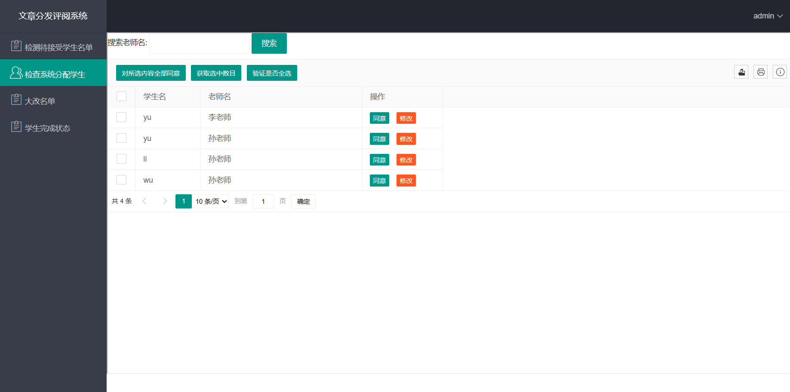
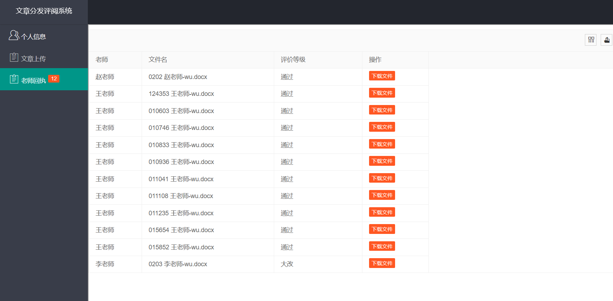
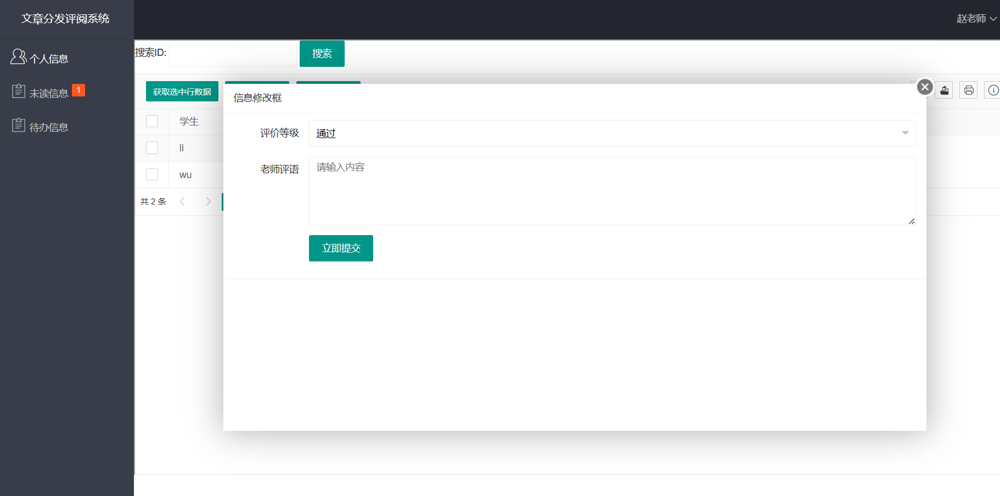
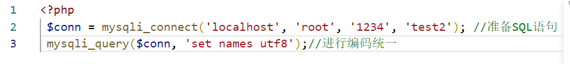

# 文章分发评阅系统

## :hamburger:前言

该项目为前后端不分离的一个简单实用项目。

## :shower:项目介绍

**文章分发评阅系统**是一个校园内部方便学生与老师文章交互，以便老师可以对学生文章进行批改。

基于<u>layui+php</u>实现。主要包括个人信息修改，匹配结果查询，匹配结果是否接受，权限管理、设置等功能。

以下为学生，老师，管理员界面展示。

## :ship:项目部署

1. 下载wamp64集成环境，然后再其www文件夹下新建一个文件夹，名称随意，如layui_php;
2. 将本项目所有文件放入上述layui_php文件夹下;
3. 在本地配置mysql数据库，项目test2.sql有示例sql语句，将其导入test2数据库,然后在其中mysql_connect.php文件中改变数据库来改变数据库连接设置即可使用。

